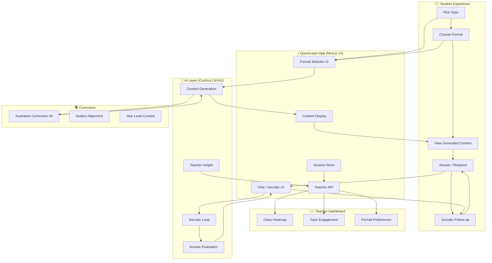
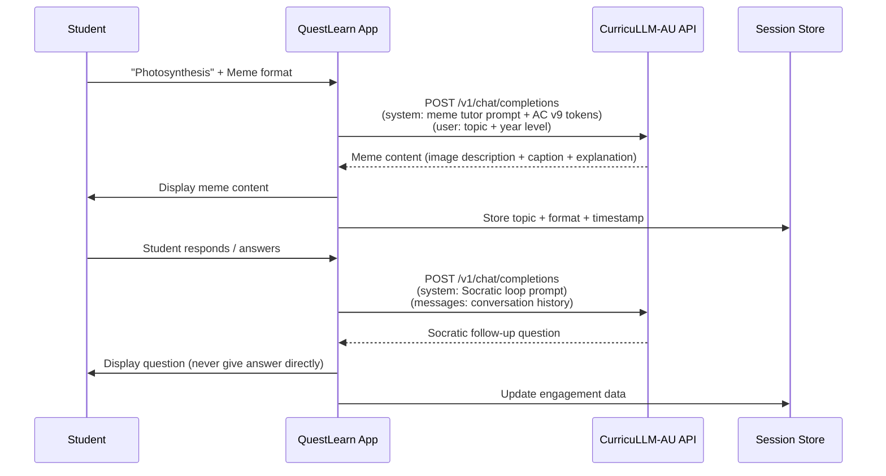
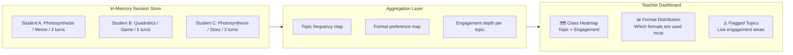
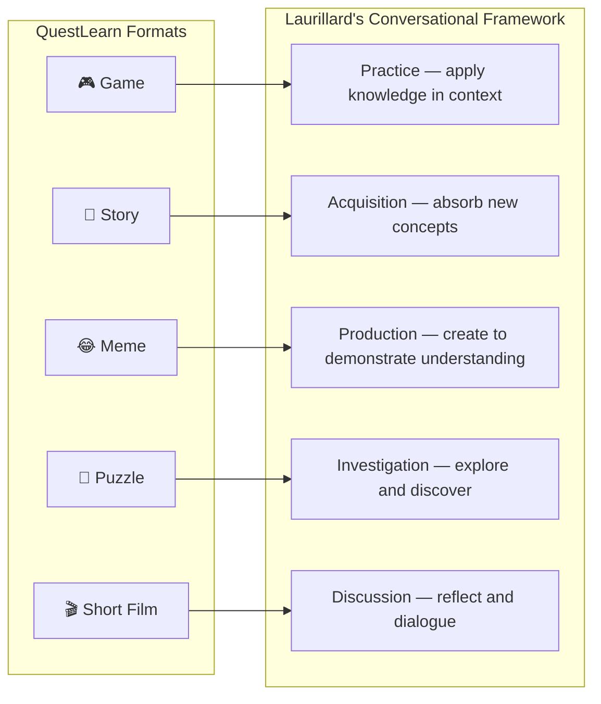
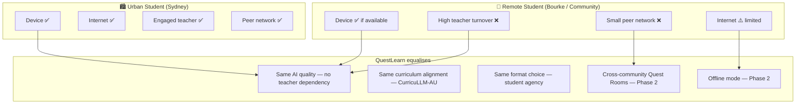
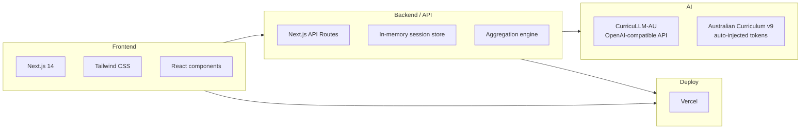

# QuestLearn — Architecture

_Cambridge EduX Hackathon 2026 · Challenge 2: AI-Incorporated Active Learning_

---

## System Overview

---

## Content Generation Flow

---

## Teacher Dashboard Data Flow

---

## Format → Laurillard Learning Type Mapping

---

## Equity Architecture

---

## Tech Stack

